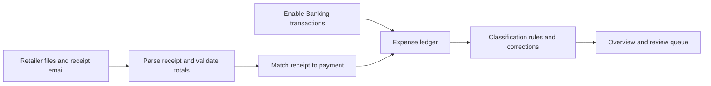

**Personal expense tracker: original build plan**

This records the initial design and research from October 2, 2026. Status notes and estimates below describe that planning stage; see [README.md](README.md) for the current implementation and operating instructions.

Build a private web application for one owner, usable from a phone and computer. It will collect bank transactions through Enable Banking, import digital receipts from Rimi, Partnerkaart, Coop, and Lidl, classify spending, and show where the money went.

Confirmed choices: private web app; existing Enable Banking production access; receipts currently arrive through a mix of apps, websites, and email. The supplied signing key was validated locally and authenticated a read-only application metadata request successfully. The application is active in production with account-information access (`AIS`) and the registered callback `https://expenses.example.com/callback`. Start with EUR and Europe/Tallinn as configurable defaults. The workspace is empty, so there is no existing application to preserve. The initial local implementation is now in this repository; see README.md for operating instructions and pending real-account validation.

The central rule is that each purchase contributes to spending once. A bank payment establishes an expense; its receipt supplies the products and category breakdown. For example, a €45 supermarket payment might become €30 groceries, €10 household supplies, and €5 alcohol. Importing the receipt must keep the expense total at €45.

Use the verified setup below and collect the remaining inputs before implementing live connections. Build the interface, database, and import workflows with fixtures while obtaining representative exports.

| Input                         | Status and handling                                                                                                                                                                              |
| ----------------------------- | ------------------------------------------------------------------------------------------------------------------------------------------------------------------------------------------------ |
| Enable Banking application ID | Verified locally; configure through `ENABLE_BANKING_APP_ID`.                                                                                                                                     |
| Private RSA signing key       | Received as an attachment and validated. The file remains outside the repository with owner-only permissions. Deploy it as a server secret referenced through `ENABLE_BANKING_PRIVATE_KEY_PATH`. |
| Enable Banking environment    | Active production application with `AIS` verified. Use a separate sandbox application for simulated integration checks if available.                                                             |
| Banks and account types       | LHV, SEB, and Revolut; live Estonia catalogue coverage confirmed. Preserve Revolut currencies separately. Available account history requires owner consent.                                      |
| Hosting and callback URL      | Local web app and worker on this machine, web port 4317. User handles the HTTPS reverse proxy; callback stays `https://expenses.example.com/callback`.                                              |
| Receipt examples              | Obtain representative exports from each retailer, including discounts, weighted products, and a refund or mixed payment where available. These determine parser requirements.                    |
| Email provider                | Free Cloudflare Email Routing + Worker/KV bridge provided, pending deployment/address configuration.                                                                                             |

Enable Banking authenticates applications using an application ID and RSA-signed JWTs. Bank consent is separate from application authentication. Personal production use with linked accounts is supported; under the current personal-use terms, API use is free, with possible limits on linked accounts. Verify that all intended accounts are linked. [Authentication documentation](https://enablebanking.com/docs/api/reference/), [personal account activation](https://enablebanking.com/docs/api/linked-accounts), [current terms](https://enablebanking.com/terms/).

Use the following architecture as the implementation default. Keep the web application and background worker in one repository, sharing the same domain code.

| Component                | Proposed choice                                                      | Purpose                                                                                                     |
| ------------------------ | -------------------------------------------------------------------- | ----------------------------------------------------------------------------------------------------------- |
| Web interface and server | TypeScript, React, Next.js                                           | Responsive screens, owner authentication, bank callbacks, uploads, and reporting.                           |
| Database                 | PostgreSQL with versioned SQL migrations                             | Transactions, receipt metadata, classifications, corrections, and import history.                           |
| Background processing    | Node.js worker with pg-boss                                          | Scheduled bank sync, receipt parsing, email ingestion, and durable retries.                                 |
| Receipt storage          | Private persistent file volume                                       | Original documents and derived text; accessible through authenticated routes.                               |
| Document extraction      | PDF.js for PDF text; local OCR for image receipts                    | Prefer document text; use OCR when text is missing or unusable. Select the OCR engine against real samples. |
| Deployment               | Docker Compose on an always-on server, behind an HTTPS reverse proxy | Operate the app, worker, and database with persistent storage and backups.                                  |

This gives scheduled jobs a separate process so imports continue while the browser is closed. pg-boss provides scheduling and retries using PostgreSQL, avoiding another queue service. Next.js documents self-hosting behind a reverse proxy. [pg-boss](https://github.com/timgit/pg-boss), [Next.js self-hosting](https://nextjs.org/docs/app/guides/self-hosting), [PDF.js](https://mozilla.github.io/pdf.js/getting_started/).

Implement the bank connection as a complete lifecycle:

1. Show available banks, start authorization, redirect to the bank, and exchange the returned code for a session. Validate a short-lived, single-use `state` tied to the owner. Store the session and returned account metadata immediately.
2. Map accounts across renewed sessions using account identification hashes. Deduplicate booked transactions using account identity and `entry_reference` when present; `transaction_id` is not a stable deduplication key. [API reference](https://enablebanking.com/docs/api/reference/).
3. Fetch initial history with `strategy=longest`; record the coverage actually returned. For subsequent syncs, use date windows with overlap to detect late bookings and corrections. Follow every `continuation_key`, including after empty pages.
4. Begin with one scheduled sync per day and a manual refresh. Adapt to bank limits; many banks restrict unattended fetching. Supply PSU headers only for actual user-triggered requests. Track consent expiry using bank metadata and show renewal reminders. [Enable Banking FAQ](https://enablebanking.com/docs/faq/).
5. Preserve raw records and normalized transactions separately. Handle pending-to-booked transitions, missing references, repeated identical purchases, account reconnection, and bank corrections without overwriting user classifications.
6. Lock concurrent imports per account, retry transient failures with backoff, and advance the completed sync checkpoint only after all pages have been stored. Show last successful sync, history coverage, errors, and consent status for every connection.

Use file imports as the dependable receipt path for all four retailers, then add supported automation. Research found digital receipt access and export routes, but did not establish documented public receipt APIs. Direct account polling therefore needs its own feasibility check.

| Source       | Verified access                                                                                                                                                                                                                                                        | Initial import approach                                                                                 |
| ------------ | ---------------------------------------------------------------------------------------------------------------------------------------------------------------------------------------------------------------------------------------------------------------------- | ------------------------------------------------------------------------------------------------------- |
| Rimi         | Receipts in the app and website, with an email option. [Rimi](https://www.rimi.ee/rakendus).                                                                                                                                                                           | Upload downloaded receipts; ingest email bodies or attachments when samples contain the actual receipt. |
| Partnerkaart | Receipts in the app and self-service website; web PDF download and app sharing are documented. [Partnerkaart](https://www.partnerkaart.ee/et/app/), [Statistics Estonia export guide](https://www.stat.ee/sites/default/files/2025-11/Digitseki%20juhend%20EST_0.pdf). | Parse exported PDFs and shared files. Identify the underlying retailer, such as Selver or Delice.       |
| Coop         | App receipt history and PDF sharing. [Coop](https://www.coop.ee/app).                                                                                                                                                                                                  | Upload or email the shared PDF; support website exports after checking a sample.                        |
| Lidl         | Digital receipts in Lidl Plus, with an app sharing route. [Lidl](https://www.lidl.ee/c/kuidas-kasutada/s10020621), [Statistics Estonia export guide](https://www.stat.ee/sites/default/files/2025-11/Digitseki%20juhend%20EST_0.pdf).                                  | Import shared files; inspect the actual format before deciding between PDF text extraction and OCR.     |

Implement a common receipt pipeline with a separate parser for each retailer:

- Accept batch PDF and image uploads from desktop and phone. Validate file types and size limits, retain the original, hash it, and record the source and parser version.
- Extract merchant, store, receipt number, purchase date/time, currency, product descriptions, quantities, units, line amounts, discounts, deposits, totals, and payment methods when available. Preserve the original Estonian descriptions alongside normalized product names.
- Validate receipt arithmetic before using its line items. Allocate basket discounts explicitly, keeping rounding exact to the cent. Preserve receipt totals and tender amounts separately because cash, card, loyalty credit, and vouchers can differ.
- Deduplicate both identical files and repeated exports of the same receipt. Different file formats must not create another purchase. Allow corrected documents and parser upgrades to replace derived data while retaining user corrections.
- Match against payment amount, currency, merchant, and dates. Begin with a configurable seven-day booking window. Automatically link only a uniquely convincing match; show competing matches or amount discrepancies for review.
- Represent split payments with multiple receipt-to-payment links. Route unsupported or ambiguous combinations to manual reconciliation rather than guessing. A receipt imported before its bank payment remains available for later matching.
- For email, use the Cloudflare Email Routing + Worker/KV bridge to deliver raw messages to the authenticated inbound endpoint. Track message and attachment identities and process only receipt messages. Link-only emails need an authenticated retrieval path or a manual export fallback.

Investigate direct retailer connectors only after this pipeline works. For each retailer, check for a supported API or export feed and assess login renewal and format stability. If browser-assisted export is practical, isolate it as an optional connector. Automatic imports from every retailer remain contingent on that investigation; file import from all four is a required deliverable.

Model the application around these records:

| Record                              | Essential responsibilities                                                                        |
| ----------------------------------- | ------------------------------------------------------------------------------------------------- |
| Bank connection and session         | Bank identity, consent validity, session references, current status.                              |
| Account and account aliases         | Persistent account identity, currency, session-specific identifiers.                              |
| Transaction and source revision     | Original payload, stable references, amount, direction, status, dates, merchant, provenance.      |
| Receipt, document, and line item    | Original files, extracted fields, product quantities, discounts, tender amounts, parser versions. |
| Receipt-payment link                | Amount linked to each payment, match evidence, confirmation state.                                |
| Expense and category allocation     | The amount counted once, category splits, and any unallocated remainder.                          |
| Category, rule, and product mapping | Editable category hierarchy and reusable classification decisions.                                |
| Import run and correction history   | Checkpoints, failures, retries, and persistent user overrides.                                    |

Store money in integer minor units with currency and currency scale; use decimal arithmetic for quantities and unit prices. Preserve source dates, use UTC for timestamps, and display local times in Europe/Tallinn. Keep balances separate from expense totals. Report currencies separately initially; combining currencies requires explicit conversion rates and a visible conversion policy.

Make the counting policy explicit in the domain model and overview:

- Count booked purchases; show pending payments separately. Receipts enrich existing expenses and do not add another amount.
- Distinguish income, spending, refunds, and transfers. Exclude confirmed transfers between owned accounts. Treat credit card repayments as transfers only when the underlying card purchases are also represented.
- Apply refunds as reductions in the relevant categories when identifiable, otherwise send them to review. Preserve both the purchase and refund records.
- Treat cash withdrawals as movement to a cash wallet. Count confirmed cash purchases once using receipts or manual entries, and display unallocated cash separately so coverage is clear.
- Keep an unmatched card receipt out of booked spending until matched or explicitly confirmed as a missing payment. Allow confirmed cash receipts to create cash expenses.
- Require category allocations to sum to the counted expense. Keep ambiguous mixed payments, voucher use, and unmatched amounts visible until resolved.

Start classification with transparent rules and persistent corrections. Use this precedence: explicit user override, user-created rules, receipt product mappings, merchant/MCC rules, then an uncategorized state. Add rule previews and an explicit option to apply a correction to similar past or future expenses. Product mappings should use retailer and product identifier where available, with normalized names as a fallback.

Seed editable categories for groceries, restaurants, housing, utilities, transport, health, household supplies, clothing, entertainment, travel, subscriptions, alcohol/tobacco, gifts, and other spending. Use receipt line categories to split mixed baskets. Without a receipt, assign a merchant-level category with its source visible; a supermarket name cannot establish what individual products were bought. Unknown expenses stay included in totals and appear in the review queue. Consider model-assisted suggestions later if measured rule coverage warrants them.

Build five primary screens:

| Screen                   | What it should let the owner do                                                                                                                 |
| ------------------------ | ----------------------------------------------------------------------------------------------------------------------------------------------- |
| Overview                 | See monthly spending, category breakdown, trends, largest merchants, refunds, and recurring payments; drill from every chart into its expenses. |
| Transactions             | Search and filter by date, account, merchant, category, amount, or receipt status; inspect and correct each expense.                            |
| Receipts                 | Upload multiple files, inspect original documents and extracted products, fix parsing, and link or unlink payments.                             |
| Review                   | Resolve uncertain categories, ambiguous matches, failed parsing, transfer candidates, and unallocated amounts.                                  |
| Connections and settings | Connect banks, renew consent, configure receipt email, edit categories and rules, export data, and see sync status.                             |

Show uncategorized spending, missing receipts, unallocated cash, and available history coverage beside the totals. Use booked dates for the default spending period and show purchase dates in receipt details. Include income and net cash flow as separate overview figures. Offer CSV exports of expenses, allocations, and receipt items. Recurring-payment detection should be a suggestion the owner can confirm.

Protect this private application with one owner account and no public signup. Use a maintained authentication implementation, secure session cookies, request validation, and authentication checks on every data route and server mutation. Keep bank signing, session data, and receipt access in server-only modules. Authenticated financial pages and files must not enter public caches. [Next.js data security](https://nextjs.org/docs/app/guides/data-security).

Keep private keys outside the repository, redact credentials and financial payloads from logs, and encrypt backups. Back up both PostgreSQL and original receipt storage on a consistent schedule; perform a full restore before launch. Make imports restart safely after a deployment or crash. Record import failures and expose retry controls inside the application. Hosting and storage costs depend on the chosen deployment; confirm those before provisioning.

Build in the following order. Estimates are working days for one experienced developer, assuming access and representative files are available; retailer automation research and provider delays can extend them.

| Phase                          | Work                                                                                                                                                       | Completion evidence                                                                                   | Estimate |
| ------------------------------ | ---------------------------------------------------------------------------------------------------------------------------------------------------------- | ----------------------------------------------------------------------------------------------------- | -------- |
| 0. Validate inputs             | Application credentials and registered callback are verified. Check actual banks, account linking, callback deployment, receipt samples, and email format. | Bank capability notes and a sample set covering all four retailers; unsupported paths documented.     | 1–2 days |
| 1. Foundation                  | Create the repository structure, schema, owner login, shared money/date utilities, worker, and deployment configuration.                                   | Authenticated app and durable jobs run locally; credentials remain server-side.                       | 2–3 days |
| 2. Banking                     | Implement consent, account discovery, initial history, incremental sync, deduplication, and renewal status.                                                | Actual bank transactions load; repeated sync and reconnection preserve identity and corrections.      | 3–5 days |
| 3. Classification and overview | Add merchant rules, manual edits, expense types, filters, dashboard, and CSV export.                                                                       | Useful bank-only overview with totals traceable to source transactions and explicit unknowns.         | 3–5 days |
| 4. Receipts                    | Add uploads, all four parsers, validation, matching, product splits, review workflows, and email ingestion.                                                | Each retailer has a working import path; matched receipts enrich spending without changing its total. | 6–9 days |
| 5. Daily operation             | Verify refunds and transfers, failure recovery, backups, restored deployment, and phone workflows.                                                         | Restore succeeds; interrupted imports recover; core workflows work on phone and desktop.              | 2–3 days |

Expected effort is approximately 4–6 weeks. Phase 3 provides an early usable version. The requested application is complete only after receipt import from all four sources, classification, and operational verification are working. Add direct retailer synchronization, richer product analytics, budgets, or model suggestions in subsequent iterations based on actual use.

Verify behavior with focused tests and representative fixtures:

- Bank fixtures cover multi-page and empty-page continuation, late bookings, pending-to-booked changes, missing references, identical distinct purchases, consent expiry, and reconnecting the same account. Re-imports must create no duplicate spending and retain corrections.
- Retailer fixtures cover normal receipts, decimal-comma amounts, weighted items, discounts, deposits, and returns where available. Validated line arithmetic must reconcile exactly; malformed documents go to review.
- Matching tests cover booking delays, repeated purchases with the same amount, split payments, receipt-before-payment ordering, and duplicate documents arriving by upload and email. Ambiguous matches must not auto-link.
- Ledger tests cover transfers, covered credit card repayments, cash withdrawals and purchases, refunds, foreign currencies, and category splits. Adding a matched receipt must leave the spending total unchanged.
- Browser checks cover owner login, bank callback state/replay handling, upload, correction, and dashboard drill-down on phone and desktop. Unauthenticated requests must not expose transactions or receipt files.
- Operational checks restore the database and files together, interrupt an import, retry a failure, and expire a bank connection. Show clear recovery actions without losing data.

For the first personal acceptance run, connect the selected banks, import representative receipts from every retailer, review a complete available month, and compare the overview to the underlying transactions. Every amount must be explainable, every unresolved item visible, and every correction preserved after the next sync. Use that month to measure classification accuracy and decide which automation would save the most effort.

Research checked against official Enable Banking, retailer, Statistics Estonia, and framework documentation on 2026-10-02. Integration formats, available history, and automation capabilities still require validation against the owner's actual accounts and exports.
